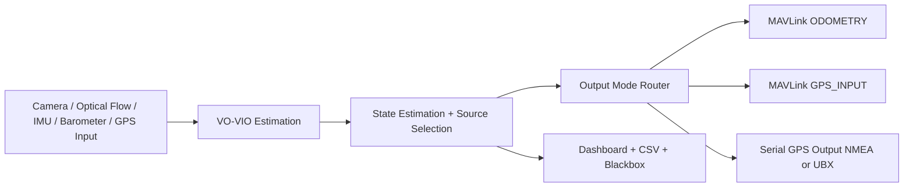
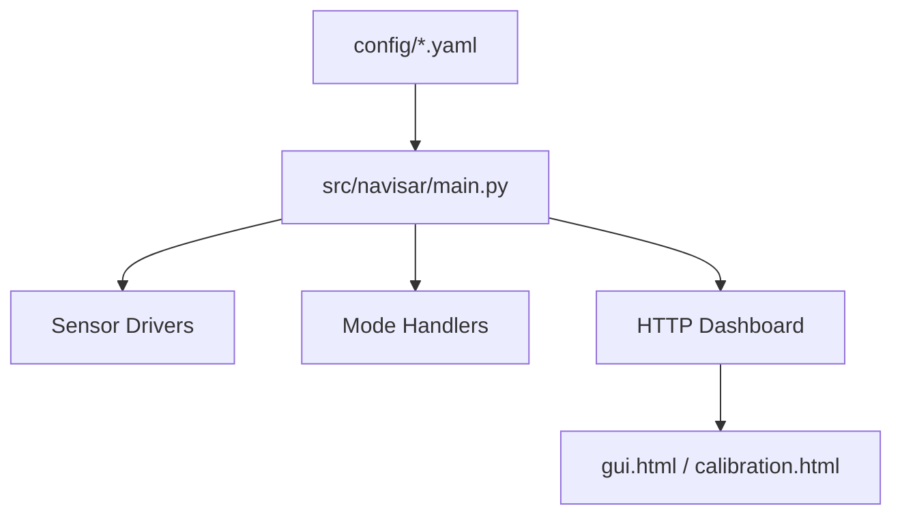
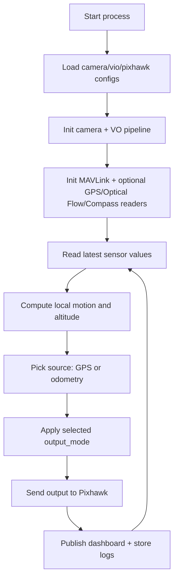
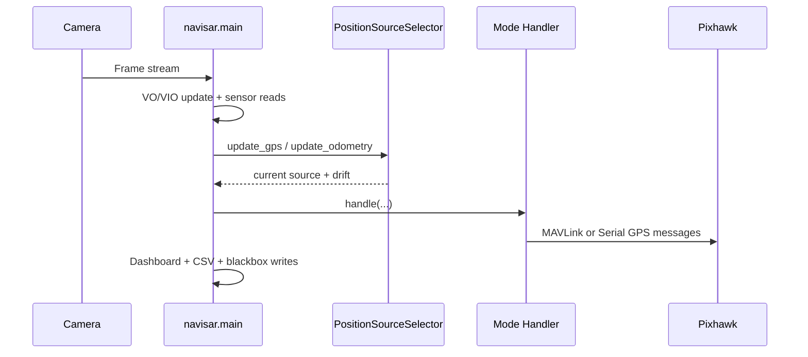

# NAVISAR-A Detailed Project Report

## 1. Document Purpose
This report is a complete technical handover for NAVISAR-A. It explains:
- What the project does.
- How runtime data flows from sensors to Pixhawk outputs.
- Which configuration file controls which behavior.
- What to change for each deployment mode.
- How to validate and troubleshoot the system.

## 2. Project Overview
NAVISAR-A is a visual-navigation and sensor-integration stack for drones. It reads camera and onboard sensor data, estimates motion, selects reliable position source(s), and transmits navigation outputs to Pixhawk.

Primary runtime entry point:
- `src/navisar/main.py`

Core loaded configuration files:
- `config/pixhawk.yaml`
- `config/vio.yaml`
- `config/camera.yaml`

## 3. High-Level Architecture


Runtime control plane:


## 4. End-to-End Runtime Flow


Message-level sequence (conceptual):


## 5. Repository Responsibility Map
Core runtime:
- `src/navisar/main.py`: orchestration, mode switching, dashboard API, recorders.
- `src/navisar/modes/*.py`: output behaviors by mode.
- `src/navisar/pixhawk/mavlink_client.py`: MAVLink transport and packet encode/decode.

Sensors:
- `src/navisar/sensors/camera.py`: camera abstraction and driver creation.
- `src/navisar/sensors/optical_flow.py`: MTF-01 reader.
- `src/navisar/sensors/barometer.py`: barometer/altitude extraction.
- `src/navisar/sensors/gps_serial.py`: GPS serial parsing/probing.
- `src/navisar/sensors/compass.py`: compass heading and calibration handling.

Navigation/fusion:
- `src/navisar/navigation/state_estimator.py`: GPS vs odometry source gating.
- `src/navisar/fusion/sensor_fusion.py`: fusion utilities.
- `src/navisar/vps/*.py`: VO/VIO tracking and motion estimation.

Operations:
- `scripts/start_navisar.sh`: launch wrapper for runtime/service.
- `scripts/bootstrap_rpi_autostart.sh`: CM4 provisioning script.
- `scripts/install_autostart_service.sh`: systemd service installation.

## 6. Configuration Files: What to Write Where

### 6.1 `config/pixhawk.yaml` (primary runtime and IO control)
Use this file for communication ports, output mode, sensor sources, and operational tuning.

| Section/Key | What it controls | Typical value |
|---|---|---|
| `use_mavlink` | Enable Pixhawk MAVLink link | `true` |
| `device`, `baud` | Pixhawk MAVLink serial interface | `/dev/ttyACM0`, `115200` |
| `output_mode` | Which output handler runs | `gps_mavlink`, `gps_port`, `odometry`, `optical_flow_*` |
| `gps_origin.lat/lon/alt` | Global anchor for local-to-GPS conversion | Site-specific |
| `gps_input.*` | Real GPS receiver connected to Pi | port + baud + format |
| `gps_output.*` | GPS stream sent from Pi to Pixhawk GPS port | NMEA/UBX settings |
| `optical_flow.*` | MTF-01 serial and altitude behavior | port + baud + filters |
| `optical_flow_mavlink.*` | Optical-flow-to-MAVLink tuning | quality/speed gating |
| `optical_flow_vo.*` | Auto switching thresholds | switch distance and modes |
| `compass.*` | Heading source and smoothing | enabled + calibration file |
| `barometer.*` | Barometer message/rate setup | MAVLink message names |
| `calibration.*` | Runtime calibration controls and storage | enabled + tuning values |
| `gnss_monitor.*` | GNSS spoof detector and reporter | thresholds + cooldown |
| `print_*` | Runtime console verbosity | true/false |

Practical guidance:
- Set all serial ports first (`device`, `gps_input.port`, `gps_output.port`, `optical_flow.port`).
- Set `output_mode` next.
- Set `gps_origin` before any fake GPS output modes.
- Tune rates and filters only after baseline operation is stable.

### 6.2 `config/vio.yaml` (VO/VIO estimator behavior)
Use this file for feature tracking density, outlier gating, motion thresholds, and optional SLAM backend configuration.

| Key group | Purpose |
|---|---|
| `algorithm` | Motion estimator selection |
| `min_features`, `max_features`, `redetect_interval` | Feature lifecycle control |
| `grid_*`, `texture_threshold`, `corner_quality_level` | Feature distribution and quality |
| `metric_threshold_m`, `min_inliers`, `min_inlier_ratio` | Motion acceptance rules |
| `max_flow_mad_px`, `min_flow_px` | Optical-flow quality gating |
| `min_height_m` | Prevent low-altitude scale instability |
| `motion_gate_enabled`, `motion_deadband_m` | Noise suppression |
| `zero_motion_*` | Stationary-state filtering |
| `slam.*` | SLAM enable/backend/runtime options |

### 6.3 `config/camera.yaml` (camera driver and intrinsics)
Use this file for camera hardware selection and geometric calibration.

| Key | Purpose |
|---|---|
| `model` | Camera backend (`opencv` or `ov9281`) |
| `width`, `height`, `format`, `rate_hz` | Capture characteristics |
| `yaw_offset_deg` | Camera-to-body yaw correction |
| `intrinsics.fx/fy/cx/cy` | Projection model |
| `intrinsics.dist_coeffs` | Lens distortion correction |

### 6.4 Placeholder configs currently not active in main runtime
- `config/gnss.yaml`
- `config/indoor.yaml`
- `config/navisar.yaml`
- `config/slam.yaml`

Current `main.py` runtime path explicitly loads only camera/vio/pixhawk config files.

## 7. Deployment Profiles (copy-and-adapt)

### 7.1 Profile A: VO -> Pixhawk via MAVLink GPS_INPUT
```yaml
output_mode: gps_mavlink
device: /dev/ttyACM0
baud: 115200
gps_origin:
  lat: 12.8877173
  lon: 77.6430330
  alt: 930.8
gps_input:
  enabled: true
  port: /dev/ttyAMA5
  baud: 230400
  format: auto
  min_fix_type: 3
gps_output:
  enabled: false
```

### 7.2 Profile B: VO -> Pixhawk GPS port via UBX/NMEA serial
```yaml
output_mode: gps_port
gps_origin:
  lat: 12.8877173
  lon: 77.6430330
  alt: 930.8
gps_output:
  enabled: true
  format: ubx
  port: /dev/ttyAMA0
  baud: 230400
  rate_hz: 10
```

### 7.3 Profile C: Optical Flow -> Pixhawk GPS port
```yaml
output_mode: optical_flow_gps_port
optical_flow:
  enabled: true
  port: /dev/ttyAMA3
  baud: 115200
gps_output:
  enabled: true
  format: ubx
  port: /dev/ttyAMA0
  baud: 230400
gps_origin:
  lat: 12.8877173
  lon: 77.6430330
  alt: 930.8
```

### 7.4 Profile D: ODOMETRY-only to Pixhawk
```yaml
output_mode: odometry
use_mavlink: true
device: /dev/ttyACM0
baud: 115200
```

### 7.5 Profile E: Raw GPS passthrough
```yaml
output_mode: gps_passthrough
gps_passthrough:
  input_port: /dev/ttyAMA5
  input_baud: 115200
  output_port: /dev/ttyAMA0
  output_baud: 115200
```

## 8. Raspberry Pi CM4 Setup Guidance
Boot overlay and UART setup is automated by:
- `scripts/bootstrap_rpi_autostart.sh`

Manual runtime launcher used by service:
- `scripts/start_navisar.sh`

Service-level notes:
- Service launches with `PYTHONPATH=src` and module `navisar.main`.
- Lock file `.navisar.lock` prevents duplicate instances.

## 9. Startup Procedure (Operational)
1. Confirm cable mapping and available ports (`/dev/tty*`).
2. Set the target profile in `config/pixhawk.yaml`.
3. Verify `config/camera.yaml` for correct camera backend and intrinsics.
4. Verify `config/vio.yaml` thresholds for your expected motion/lighting.
5. Start runtime: `PYTHONPATH=src python -m navisar.main`.
6. Open dashboard: `http://127.0.0.1:8765/gui.html`.
7. Confirm live telemetry before arming/flying.

## 10. Source Selection Logic (GPS vs Odom)
`PositionSourceSelector` logic summary:
- GPS is considered available only if fresh (`gps_timeout_s`) and fix quality is sufficient (`min_fix_type`).
- Drift is computed between GPS-local and odometry positions.
- If drift exceeds `drift_threshold_m`, source switches to odometry.
- Otherwise source remains GPS when valid.

This gives degraded-operation resilience when GPS quality drops or jumps.

## 11. Output Mode Behavior Matrix
| Mode | Primary output | Destination |
|---|---|---|
| `gps_mavlink` | `GPS_INPUT` | Pixhawk MAVLink |
| `gps_port` | NMEA/UBX GPS stream | Pixhawk GPS serial port |
| `odometry` | `ODOMETRY` | Pixhawk MAVLink |
| `optical_flow_mavlink` | Optical flow MAVLink payloads | Pixhawk MAVLink |
| `optical_flow_gps_port` | GPS stream derived from optical flow | Pixhawk GPS serial port |
| `optical_flow_then_vo` | Auto mode by configured switch distance | Mixed by sub-mode |
| `gps_passthrough` | Raw GPS serial forwarding | Input GPS -> Pixhawk GPS port |

## 12. Dashboard and Logging Artifacts
Live endpoints:
- `http://127.0.0.1:8765/gui.html`
- `http://127.0.0.1:8765/calibration.html`
- `http://127.0.0.1:8765/data`

Recorded artifacts:
- `sensor_csv_logs/sensor_csv_*/sensor_data.csv`
- `blackbox_logs/flight_*/flight_data.txt`
- `blackbox_logs/flight_*/flight_video.mjpg`
- `blackbox_logs/flight_*/session_meta.json`

CSV alias fields now include explicit names:
- `raw_gps_parameter_*`
- `raw_barometer_parameter_*`
- `raw_imu_parameter_*`
- `raw_attitude_parameter_*`
- `raw_compass_parameter_*`
- `raw_camera_drift_parameter_*`
- `syn_camera_drift_x`, `syn_camera_drift_y`, `syn_camera_drift_z`
- `syn_pixhawk_port_parameter_*`

## 13. Calibration Workflow
1. Start runtime and open `calibration.html`.
2. Enable calibration features in `config/pixhawk.yaml` (`calibration.enabled: true`).
3. Tune optical-to-GPS scales in `calibration.optical_gps_tuning`.
4. Save and persist values back to `config/pixhawk.yaml`.
5. Re-run and verify track alignment against GPS.

Camera intrinsics calibration:
- Use `tools/camera_calibration.py`.
- Copy resulting intrinsic matrix and distortion coefficients into `config/camera.yaml`.

Compass calibration:
- Use calibration tools in `tools/` and set `compass.calibration_file` accordingly.

## 14. Validation Plan
Bench validation checklist:
1. Process starts with no import/runtime errors.
2. Dashboard `/data` endpoint updates continuously.
3. Active mode in dashboard matches `output_mode` in config.
4. GPS origin is present for GPS-generation modes.
5. Expected Pixhawk message stream appears on target interface.
6. Sensor CSV is generated and contains expected alias fields.

Flight-readiness checklist:
1. Stable heading source and reasonable yaw changes.
2. Position does not diverge rapidly at hover.
3. No repeated stale-port or missing-sensor warnings.
4. Controlled mode-switch behavior if `optical_flow_then_vo` is used.

## 15. Troubleshooting Guide
| Symptom | Likely cause | Action |
|---|---|---|
| No dashboard data | process not running or bind issue | restart process, check `NAVISAR_DASHBOARD_*` env |
| GPS output not reaching Pixhawk | wrong `gps_output.port` or baud | verify wiring and serial path |
| Frequent source switch to odometry | GPS drift/fix issues | check antenna, `gps_min_fix_type`, drift threshold |
| Optical flow noisy | quality/scale mismatch | tune `optical_flow.*` and `optical_flow_mavlink.*` |
| Heading unstable | compass offsets/smoothing not tuned | tune `compass.heading_*` and calibration file |
| CSV missing expected fields | old log session | start a new sensor CSV session |

## 16. Security and Safety Notes
- Never assume safe flight behavior from unvalidated parameter changes.
- Lock down serial mappings and avoid dynamic port renumbering in production.
- Keep a known-good config snapshot before tuning.

## 17. Recommended Handover Package
For project submission, include:
1. This report file.
2. One tested config set per mission profile.
3. One sensor CSV sample and one blackbox sample.
4. A short test log with date, firmware version, and pass/fail checks.

## 18. Appendices

### Appendix A: Standard Run Commands
```bash
source venv/bin/activate
PYTHONPATH=src python -m navisar.main
```

### Appendix B: Useful Service Commands
```bash
sudo systemctl status navisar.service
sudo systemctl restart navisar.service
sudo systemctl stop navisar.service
```

### Appendix C: Important Paths
- Runtime entry: `src/navisar/main.py`
- Main runtime config: `config/pixhawk.yaml`
- VO tuning config: `config/vio.yaml`
- Camera config: `config/camera.yaml`
- Dashboard UI: `simulation/gui.html`
- Calibration UI: `simulation/calibration.html`
